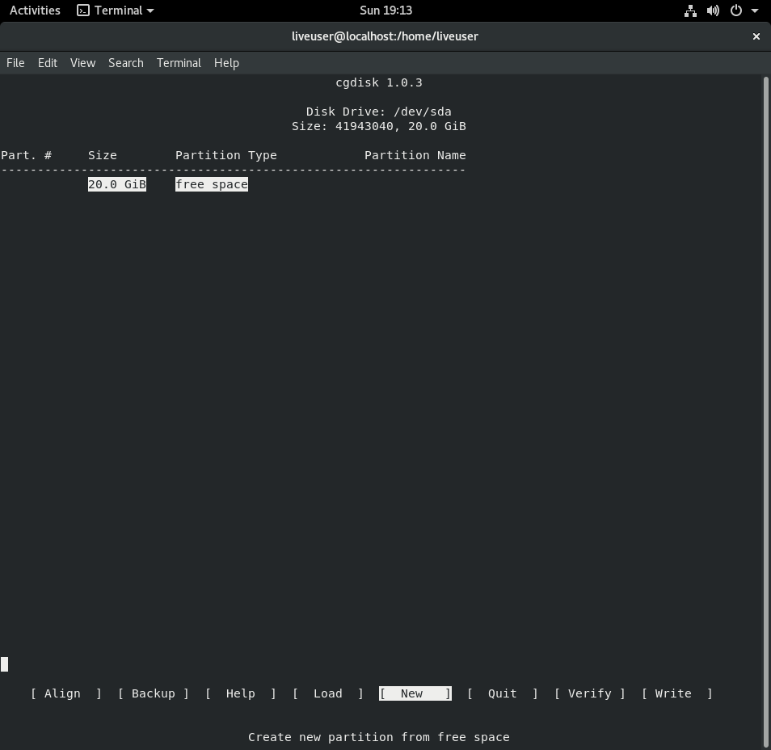
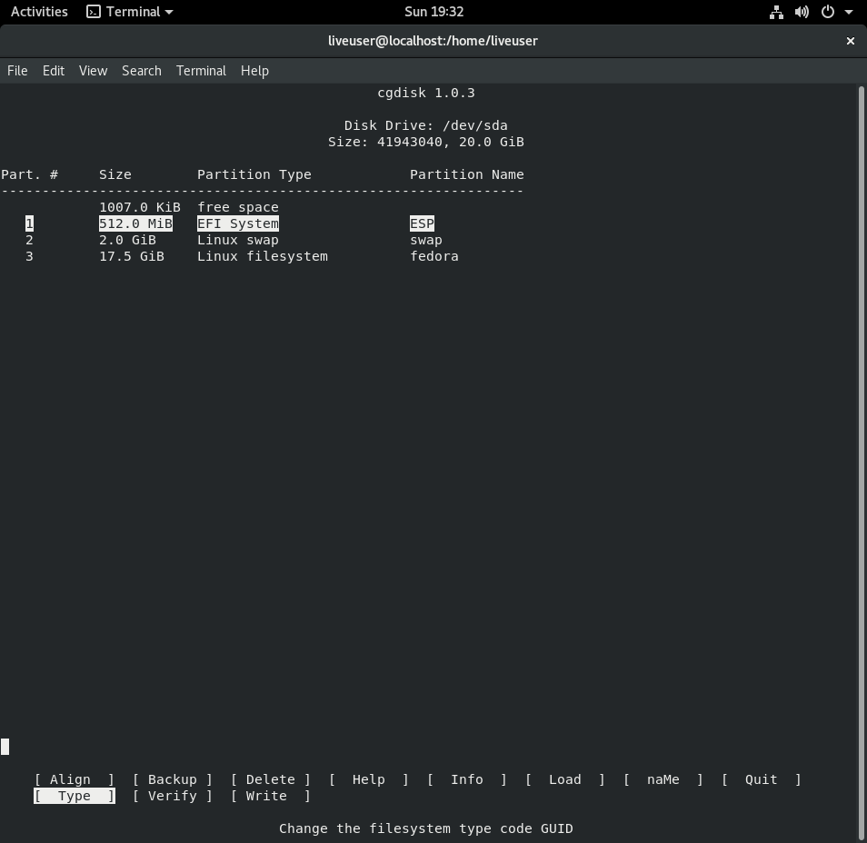

## Pre Installation

Download required scripts

    $ mkdir src ; cd src
    $ wget https://github.com/glacion/easy-chroot/releases/download/v1.0/chroot https://github.com/glacion/genfstab/releases/download/1.0/genfstab https://raw.githubusercontent.com/glacion/fedora-chroot-installation/master/scripts/zz-efistub-upgrade.py ; chmod +x *

## Partitioning
For this VM we will have 3 partitions for `/`, `/boot` and `swap`.

* `/` partition will use `ext4`
* `/boot` is the ESP(EFI System Partition) of our system, therefore it will use `fat32`.
* `swap` is well... `swap`

### Determine the name of your drive
Output of the below command gives us information about the bulk devices(Hard Drives etc.).

    $ lsblk
    NAME        MAJ:MIN RM  SIZE RO TYPE MOUNTPOINT
    loop0         7:0    0  1.6G  1 loop 
    loop1         7:1    0  6.5G  1 loop 
    ├─live-rw   253:0    0  6.5G  0 dm   /
    └─live-base 253:1    0  6.5G  1 dm   
    loop2         7:2    0   32G  0 loop 
    └─live-rw   253:0    0  6.5G  0 dm   /
    sda           8:0    0   20G  0 disk 
    sr0          11:0    1  1.7G  0 rom  /run/initramfs/live

In this example `sda` is our Hard Drive, output of `lsblk` omits the `/dev/` path, so we will be using `/dev/sda` for our operations.

### Creating GUID Partition Table and Partitions Using `cgdisk`
Running `# cgdisk /dev/sda` gives us an error like;
     
    Warning! Non-GPT or damaged disk detected! This program will attempt to
    convert to GPT form or repair damage to GPT data structures, but may not
    succeed. Use gdisk or another disk repair tool if you have a damaged GPT
    disk.

This is safe to ignore as in this case, our hard drive doesn't actually contain a partition table. 

This probably won't be the case in real-world scenarios. Though if you'd like to nuke down your partition table(s), you can run `sgdisk -Z /dev/sda`.

After that this screen will greet us;

In this screen we will create our partitions by selecting `[New]` option for each partition;

    #ESP
    First Sector: Leave This Blank
    Size in sectors: 512M 
    Hex Code: EF00
    Enter new partition name: ESP

    #Swap
    First Sector: Leave This Blank
    Size in sectors: 2G
    Hex Code: 8200
    Enter new partition name: swap

    #Root
    First Sector: Leave This Blank
    Size in sectors: Leave This Blank
    Hex Code: Leave This Blank
    Enter new partition name: fedora

The end result should look like this;

After you're done; press `[Write]`, type `yes` to the prompt, and quit `cgdisk`.

## Creating and Mounting the Filesystems

Now that we have our partitions, it is time to put filesystems on them.

**Note:** It is **not** necessary for the partition names we defined in `cgdisk` to match the filesystem labels we are going to use below, feel free to change them according to your needs.

* ESP (EFI System Partition)

    Create a `FAT32` filesystem on `/dev/sda1` with the label `ESP`.

      # mkfs.vfat /dev/sda1 -n ESP

* Swap Partition

    Create swap on `/dev/sda2` with label `swap`.

      # mkswap /dev/sda2 -L swap

* Root Partition

    Create an `ext4` filesystem on `/dev/sda3` with label `fedora`.

      # mkfs.ext4 /dev/sda3 -L fedora

Now we have some filesystems ready to use. It's time to mount them.

* Mount our root partition on /mnt.

      # mount /dev/sda3 /mnt

* Let the system know that swap will be here.

      # swapon /dev/sda2

* Create the mountpoint for our ESP and mount the ESP.

      # mkdir /mnt/boot
      # mount /dev/sda1 /mnt/boot

After this your `lsblk` output should look like this;
    
    $ lsblk
    NAME        MAJ:MIN RM  SIZE RO TYPE MOUNTPOINT
    loop0         7:0    0  1.6G  1 loop 
    loop1         7:1    0  6.5G  1 loop 
    ├─live-rw   253:0    0  6.5G  0 dm   /
    └─live-base 253:1    0  6.5G  1 dm   
    loop2         7:2    0   32G  0 loop 
    └─live-rw   253:0    0  6.5G  0 dm   /
    sda           8:0    0   20G  0 disk 
    ├─sda1        8:1    0  512M  0 part /mnt/boot
    ├─sda2        8:2    0    2G  0 part [SWAP]
    └─sda3        8:3    0 17.5G  0 part /mnt
    sr0          11:0    1  1.7G  0 rom  /run/initramfs/live

## Installing The System

After we are done partitioning; we can finally install the base system onto our new partitions.

    # dnf install --installroot=/mnt --releasever=28 --setopt=install_weak_deps=False glibc-langpack-en rtkit file efibootmgr deltarpm @Core

Confirm the prompts when asked.

Let's break down what this command does;

* `--installroot=/mnt` treat `/mnt` as the installation root.
* `--releasever=28` use Fedora 28 as target release, use `rawhide` if you want a 'rolling release' Fedora.
* `--setopt=install_weak_deps=False` don't install weak dependencies(`--no-install-recommends` on Debian), more info about these switches can be found [here](https://dnf.readthedocs.io/en/latest/conf_ref.html)
* `glibc-langpack-en` English langpack for glibc, in order to have a localized system install `glibc-langpack-<LANGCODE>` if no langpack is specified to install, dnf will install `glibc-all-langpacks` package which costs a whopping 100MB alone compared to installing them seperately which costs around 1MB per langpack. 
* `rtkit`, `file`, `efibootmgr` See `dnf info <PACKAGE_NAME>` for details.
* `@Core` is a small set of packages that's sufficient enough for the system to function.

## Configuration

* Copy the `zz-update-efistub.py` from the directory you cloned in the first steps to live system. The script will update the kernel and initrd to `/boot/<MACHINE_ID>/current`

      # cp zz-efistub-upgrade.py /mnt/etc/kernel/postinst.d/
    
* Configure the system locale, keymap, timezone, hostname and setup machine id on your new system, usage given below;
    
      # systemd-firstboot \
      --root=/mnt \
      --locale=<LOCALE> \
      --keymap=<KEYMAP> \
      --timezone=<TIMEZONE> \
      --hostname=<HOSTNAME> \
      --setup-machine-id
    
    Example;
    
      # systemd-firstboot \
      --root=/mnt \
      --locale=en_US.UTF-8 \
      --keymap=tr-intl \
      --timezone=Europe/Istanbul \
      --hostname=fedora \
      --setup-machine-id

    Keep in mind that you can always copy the configuration that's in the live system you're running, or let the tool prompt for each of them so you can select from a list if you don't know the names you're going to use. See `systemd-firstboot --help` for details.

* Generate fstab

      # ./genfstab -L /mnt >> /mnt/etc/fstab
    
    We generate the fstab file and save it in our new system.

    `-L` switch tells `genfstab` to use labels for partitions, use `-U` instead if you want to use UUIDs instead. see `genfstab --help` for details.

* Chroot to Our New Installation

      # ./chroot /mnt

* Selinux

    After this installation, the selinux labels are likely to be broken and cause the system to not work properly, to fix this we'll set it to `permissive` until we recreate the labels.
    Issue this command;

      # sed -i 's/=enforcing/=permissive/g' /etc/sysconfig/selinux

* Check Internet Connection in Chroot
    
    If `ping google.com` fails but `ping 8.8.8.8` works, you need to get the `/etc/resolv.conf` from the host manually. Exit the chroot, run 
        
      # touch /mnt/etc/resolv.conf
      # mount -o bind /etc/resolv.conf /mnt/etc/resolv.conf
     
    and chroot back in. 

* Create a new user and give it a password

      # useradd -c "YOUR_FULL_NAME" -m -g users -G wheel -s /bin/bash YOUR_USERNAME
      # passwd YOUR_USERNAME

## Cleanup
Even though the system we installed is pretty minimal, there's always more room to clean up. 

Note: Removing these packages are **not** required to have a functioning system, and the packages we are going to remove **can** break some functionality that you need, proceed with caution.

    (chroot) dnf remove dracut-config-rescue grubby man-db openssh-server parted

## Bootloader
We'll be using the linux kernel's built-in capabilities without an external bootloader.

For safety reasons we'll also install & configure `systemd-boot` formerly known as `gummiboot`

**Note:** If you're following this guide from VirtualBox, you should stick to a traditional bootloader since it doesn't really like it when we modify EFI variables directly. 

1. Start by installing the kernel itself.
      
       (chroot) dnf install kernel

2. Installing `systemd-boot` as backup
        
       (chroot) bootctl install
    
    We need to fix boot parameters. After installing the kernel, the auto-generated entry uses the boot parameters of the live system. The entry exists in `/boot/loader/entries/<MACHINE_ID>-<KVER>.conf`

    Example;

       (chroot) vi /boot/loader/entries/52f380e6dcad40e28eb396d515d4e16d-4.17.18-200.fc28.x86_64.conf

    We need to fix the `options` field in this file from;

       options    BOOT_IMAGE=/images/pxeboot/vmlinuz root=live:CDLABEL=Fedora-WS-Live-28-1-1 rd.live.image quiet

    to;

       options    root=LABEL=fedora ro rhgb quiet
3. Copy the kernel and initramfs
       
       (chroot) /etc/kernel/postinst.d/zz-efistub-upgrade.py
    
    **Note:** Take note that if you have your ESP mounted on a location different than `/boot` or `/boot/efi`, you'll have to run the script like below;

       (chroot) /etc/kernel/postinst.d/zz-update-efistub.py --esp /path/to/esp

    Furthermore, you'll need to either wrap this in another script or modify the script to hardcode your ESP path, Search for `# Determining the ESP` in your favorite editor, delete the whole try-except block and assign the esp variable like `esp = /path`.

4. Create EFI entry

    Take note of the content of your `/etc/machine-id` in my case it was `52f380e6dcad40e28eb396d515d4e16d` 

       (chroot) efibootmgr -d /dev/sda -p 1 -c -L 'fedora' -l /52f380e6dcad40e28eb396d515d4e16d/current/linux -u 'root=LABEL=fedora ro rhgb quiet initrd=/52f380e6dcad40e28eb396d515d4e16d/current/initrd'

    **Note:** When your ESP is on `/dev/sda1` you can omit the `-d` and `-p` parts.
    
    **Note:** When you want to edit the boot parameters, you need to delete the entry, and recreate it. Example;

       (chroot) efibootmgr -v
       BootCurrent: 0001
       BootOrder: 0004,0005,0000,0001,0002,0003
       Boot0000* EFI VMware Virtual SCSI Hard Drive (0.0)	PciRoot(0x0)/Pci(0x10,0x0)/SCSI(0,0)
       Boot0001* EFI VMware Virtual IDE CDROM Drive (IDE 1:0)	PciRoot(0x0)/Pci(0x7,0x1)/Ata(1,0,0)
       Boot0002* EFI Network	PciRoot(0x0)/Pci(0x11,0x0)/Pci(0x0,0x0)/MAC(000c29a05543,0)
       Boot0003* EFI Internal Shell (Unsupported option)	MemoryMapped(11,0xcb3a000,0xcfa0fff)   /FvFile(c57ad6b7-0515-40a8-9d21-551652854e37)
       Boot0004* fedora	HD(1,GPT,1b922c5f-13b2-455f-9c0e-7953f70abe01,0x800,0x100000)/File   (\52f380e6dcad40e28eb396d515d4e16d\current\linux)r.o.o.t.=.L.A.B.E.L.=.f.e.d.o.r.a. .r.o.    .r.h.g.b. .q.u.i.e.t.    .i.n.i.t.r.d.=./.5.2.f.3.8.0.e.6.d.c.a.d.4.0.e.2.8.e.b.3.9.6.d.5.1.5.d.4.e.1.6.d./.c.u.r.r.e.   n.t./.i.n.i.t.r.d.
       Boot0005* Linux Boot Manager	HD(1,GPT,1b922c5f-13b2-455f-9c0e-7953f70abe01,0x800,0x100000)   /File(\EFI\systemd\systemd-bootx64.efi)
       (chroot) efibootmgr -b 0004 -B

5. Reboot
    Now that we're done with our bootloaders, we can reboot to our new installation.
    
    If you manually mounted `/etc/resolv.conf`, run `# umount /mnt/etc/resolv.conf` now.

       (chroot) exit
       # umount -R /mnt
       $ reboot

## Inside The New System

### SELinux

Well, we now have a *somewhat* working system, even though it just hanged at boot for 1 min 30 seconds trying to raise auditd.service. 

This happened because our new installation does not have proper SELinux file labels.

To recreate the SELinux Labels issue this command and reboot.

    # fixfiles -F onboot
    # reboot

The next boot will take significantly longer, as it will rebuild the labels.

After system rebuilds the labels and reboots again, we can set enforcing back again, to do this issue this command;

    # sed -i 's/=permissive/=enforcing/g' /etc/sysconfig/selinux

After a reboot, the system should work fine under enforcing SELinux.

To confirm everything went correctly, we'll check the following items;

* The output from `$ systemctl status` should show State as `running`.
* `$ ping google.com` should work fine.
* `$ reboot` should work fine.
* `$ getenforce` should return 'Enforcing'

### Cleanup

* When we set SELinux to permissive at the beginning, we told SELinux to only *log* the denials, and this might have cluttered up the logs, we'll clean them now.

       # rm -rf /var/log/*

* Clean the caches.

       # rm -rf /var/cache/*

* Clean up `dnf`.
       
       # dnf clean all

Reboot when you're finished.

And you're done! You can get the default Fedora Workstation installation by issuing the command below.

    # dnf install @Fedora\ Workstation
